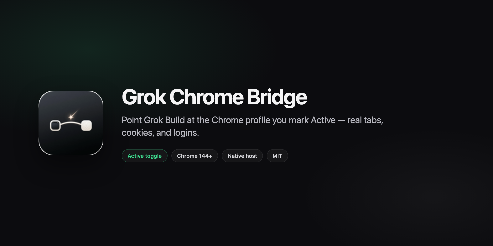
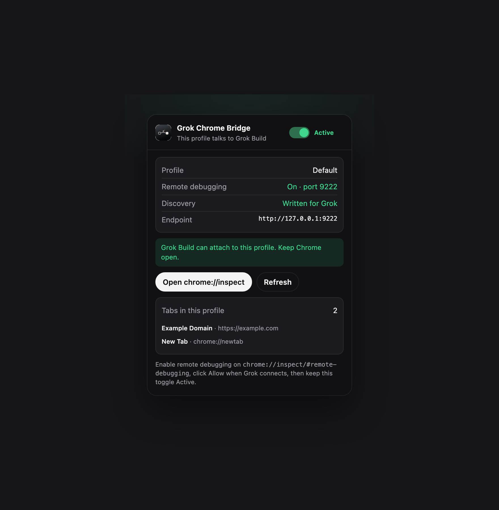

# Grok Chrome Bridge

<p align="center">
  
</p>

<p align="center">
  <a href="LICENSE"></a>
  <a href=".github/workflows/ci.yml"></a>
  
  
</p>

Chrome extension that lets **[Grok Build](https://grok.x.ai)** attach to **this Chrome profile** — the one where you mark the extension **Active** — instead of launching an empty isolated browser.

Grok then sees that profile’s tabs, cookies, and logins.

<p align="center">
  
</p>

## Why this exists

`chrome-devtools-mcp` (what Grok Build uses) starts a throwaway Chrome profile by default. `--autoConnect` can attach to a running Chrome 144+ instance, but it always picks Chrome’s **default** profile.

This extension flips that: you choose the profile. Mark it Active, Grok connects there.

## How it works

```
This Chrome profile          Native host                 Grok Build
┌──────────────────┐     ┌─────────────────────┐     ┌──────────────────┐
│ Grok Chrome      │ NM  │ Writes              │     │ MCP wrapper      │
│ Bridge · Active  │────▶│ ~/.grok/            │────▶│ chrome-devtools  │
│                  │     │ chrome-bridge.json  │     │ --ws-endpoint    │
└──────────────────┘     └─────────────────────┘     └──────────────────┘
```

The extension cannot turn remote debugging on by itself. Chrome 144+ does that from `chrome://inspect/#remote-debugging`.

| Piece | Path | Role |
|-------|------|------|
| Extension | `extension/` | MV3 popup + Active toggle |
| Native host | `native-host/` | Finds this Chrome’s DevTools port |
| MCP wrapper | `mcp/` | Starts `chrome-devtools-mcp` against that endpoint |

## Install

**Needs:** macOS, Python 3, Node.js 20+, Chrome 144+.

```bash
git clone https://github.com/davidsolheim/grok-chrome-bridge.git
cd grok-chrome-bridge
./scripts/install.sh
```

That registers the native host `com.grokchromebridge.host` for Chrome, Chromium, Brave, and Edge.

To also point Grok Build at this wrapper (rewrites only `[mcp_servers.chrome-devtools]` in `~/.grok/config.toml`):

```bash
./scripts/install.sh --configure-grok
```

Then:

1. Open `chrome://extensions` → **Developer mode** → **Load unpacked** → the repo’s `extension/` folder.
2. Confirm the ID is `kaelkjfngeajflpnjpgoijcjjcalnphi`.
3. Open `chrome://inspect/#remote-debugging` and enable remote debugging.
4. Click the extension icon → **Active**.
5. Restart Grok Build so MCP reconnects.

```bash
node mcp/grok-chrome-mcp.mjs --status
```

## Daily use

1. Open the Chrome profile you want Grok to use.
2. Click **Active**.
3. Keep that Chrome window open.
4. Work in Grok as usual.

Only one profile should be Active. Activating another profile takes over.

## Security

This is a **local browser-control** tool. An Active profile plus Chrome remote debugging lets any local process attach to that browser.

- Discovery file is mode `0600` and holds loopback DevTools URLs only — not tab URLs, cookies, or account names.
- Native messaging `allowed_origins` is locked to this extension’s ID.
- The host only probes `127.0.0.1`.
- `manifest.json` `key` is a **public** key (stable unpacked ID), not a private key.

Read [SECURITY.md](SECURITY.md) before using this on a profile that has sensitive sessions.

## Troubleshooting

| Symptom | Fix |
|---------|-----|
| Popup: native host not found | `./scripts/install.sh`, then reload the extension |
| Remote debugging Off | `chrome://inspect/#remote-debugging` → enable → Refresh |
| `--status` says no Active profile | Toggle Active in the profile you want |
| Grok still opens a blank Chrome | Confirm `~/.grok/config.toml` chrome-devtools command is `node` + this wrapper; restart Grok |
| Wrong profile | Activate the extension **in** the desired profile (storage is per-profile) |
| Extension ID changed | Don’t remove the `key` in `manifest.json`; re-run `install.sh` |

## Develop

```bash
python3 tests/test_native_host.py
node tests/test_mcp_wrapper.mjs
```

See [CONTRIBUTING.md](CONTRIBUTING.md) and [shared/protocol.md](shared/protocol.md).

## License

MIT © [David Solheim](https://github.com/davidsolheim)
